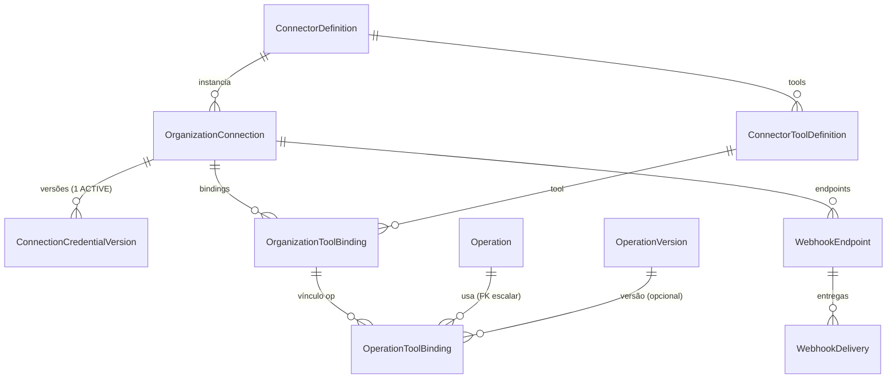

# ARDEN-BE-006 — Plano técnico: conectores, credenciais, ferramentas externas e webhooks

> **Etapa ARDEN-BE-006.1 — análise e planejamento.** Este documento é o plano
> executável do milestone. **Nenhum** código, migration, contrato Zod, OpenAPI ou
> mudança funcional de frontend é produzido nesta etapa — apenas documentação.
>
> - Branch: `claude/arden-be-006-connectors-tools`
> - Commit-base: `0105d71` (topo de `claude/arden-be-005-execution-engine`)
> - Base do milestone: ARDEN-BE-005 (motor de execução durável)
> - Documentos irmãos desta etapa:
>   - [`docs/backend/CREDENTIAL_VAULT_DECISION.md`](../backend/CREDENTIAL_VAULT_DECISION.md) — cofre + threat model de credenciais
>   - [`docs/backend/SSRF_PREVENTION.md`](../backend/SSRF_PREVENTION.md) — threat model + pipeline SSRF
>   - [`docs/backend/CONNECTOR_DEPENDENCY_REVIEW.md`](../backend/CONNECTOR_DEPENDENCY_REVIEW.md) — decisão de dependências

---

## 1. Objetivo do milestone

Implementar a primeira camada **segura** de integração do Arden.AS com sistemas
externos: catálogo de conectores versionado, conexões por organização, credenciais
criptografadas em repouso, ferramentas tipadas vinculadas a operações, execução
controlada pelo worker do BE-005, webhooks autenticados (entrada/saída) e prevenção
de SSRF/exfiltração/cross-tenant. O backend é a fonte de verdade; o frontend nunca
injeta credencial na execução e nunca persiste segredo.

O fluxo central: **uma etapa publicada referencia uma ferramenta registrada; o
worker resolve a conexão do tenant, recupera a credencial somente no servidor,
valida a política de rede e executa a ferramenta de forma auditável e reproduzível.**

---

## 2. Leitura e mapeamento realizados (convenções reais do repositório)

Mapeamento concluído sobre o código existente. Referências de arquivo abaixo são as
que o plano reutiliza — nada é presumido.

### Contratos e OpenAPI
- Schemas Zod compartilhados em `src/contracts/<área>/*.schemas.ts`; descritores de
  endpoint em `*.contract.ts` exportando `{ <área>Schemas, <área>Endpoints }`.
- Registro único: `src/contracts/registry.ts` agrega `schemaRegistry` (→
  `components.schemas`) e `endpoints[]` (→ paths, matriz, testes). Barrel:
  `src/contracts/index.ts`.
- OpenAPI é **100% derivado** de `endpoints` + `schemaRegistry` por
  `src/contracts/openapi/build-openapi.ts` (via `zodToJsonSchema`, target `openApi3`).
  Driver: `scripts/generate-openapi.ts` → `npm run contracts:openapi` →
  `docs/api/openapi-v1.yaml`. **CI** roda `git diff --exit-code` sobre o YAML
  (`.github/workflows/ci.yml`). A lista `TAGS` em `build-openapi.ts` é o único
  literal a estender (adicionar `Connectors`).
- Descritor `EndpointContract` (`src/contracts/endpoint.ts`): `id, method, path,
  summary, tag, permission, idempotent, optimisticConcurrency, requestSchema?,
  querySchema?, pathParams[], successStatus, responseSchema`. `Idempotency-Key` e
  `If-Match` são emitidos pelo gerador quando `idempotent`/`optimisticConcurrency`.
- Cliente v1: `src/services/api/generated/api-v1-client.ts` (interface **manual**,
  coberta por testes de compatibilidade) + `src/services/api/v1-http-client.ts`
  (impl. HTTP). `@/contracts` e `@arden/contracts` resolvem para o MESMO
  `src/contracts` (backend importa `@arden/contracts`; frontend `@/contracts`).
- `correlationId`: propagado por `X-Correlation-Id` (cliente) e por
  `ctx.correlationId` no backend; presente em todo `ApiErrorResponse` e em eventos.
- Validação contratual no CI: `src/contracts/contracts.test.ts` (permissão de
  endpoint ∈ `ALL_PERMISSIONS`; `organizationId` proibido em request body; arquivos
  de contrato sem import de React/Zustand) e `src/contracts/openapi/openapi.test.ts`
  (YAML em disco == doc recém-gerado).

### Autorização e permissões
- SSOT: `src/domain/permissions.ts` (`Permission` union + `ALL_PERMISSIONS` +
  `ROLE_PERMISSIONS`). Seed backend (`apps/api/prisma/seed.ts`) **deriva** desse
  arquivo (upsert de `permission` + `role_permissions`, com convergência que remove
  o que saiu). Decorators: `apps/api/src/authz/decorators.ts`
  (`@RequireOrganization()`, `@RequirePermission(string)`). Guards globais em
  `apps/api/src/authz/guards/*` (`permission.guard.ts` usa `Set<string>` em runtime).
- Testes de sincronia (**devem permanecer verdes**): `contracts.test.ts`
  (permissão de endpoint ∈ catálogo) e
  `apps/api/test/identity-authz.integration.spec.ts` (contagem de `permission` ==
  `ALL_PERMISSIONS.length`).

### Idempotência (reutilizar — não criar um segundo sistema)
- Tabela `idempotency_records` (unique `[method, path, idempotencyKey]`, TTL 24h).
  Serviço `apps/api/src/modules/idempotency/idempotency.service.ts`
  (`hashRequestBody`, `check`, `remember`, `purgeExpired`).
- Helper `runIdempotentCommand(deps, parts, body, statusCode, command(tx, prepared),
  prepare?)` em `apps/api/src/operations/command.helpers.ts` — grava a resposta no
  MESMO `tx` do comando. Escopo por tenant/usuário: `idempotencyKey =
  \`${userId}:${idempotencyKey}\``. Replay retorna a resposta armazenada; body
  diferente → `IDEMPOTENCY_CONFLICT`.

### Auditoria (reutilizar `audit_events`)
- `AuditRecorder.record(tx, input)` em `apps/api/src/audit/audit.recorder.ts`; modelo
  `AuditEvent` (append-only; `before/after`; `metadata` redigido por
  `/(authorization|token|secret|password|cookie)/i`). Ação nomeada
  `<resourceType>.<verbo-no-passado>`. `AuditModule` exporta `AuditRecorder`.

### Evidências (reutilizar `evidence_records`)
- `ExecutionRecorder.recordEvidence(tx, input)` em
  `apps/api/src/executions/execution.recorder.ts`; `sanitizeContent` (redação
  recursiva de chaves sensíveis) + `hashContent` (sha256 do conteúdo já sanitizado).
  Evidências vinculam `executionRunId`/`executionStepId`. Eventos append-only com
  sequência monotônica.

### Execução, fila e worker
- Worker: processo lógico separado (`apps/api/src/worker.ts` sobe
  `createApplicationContext(AppModule)` — **qualquer módulo em `AppModule.imports`
  fica disponível ao worker**).
- Fila durável `execution_jobs` (`FOR UPDATE SKIP LOCKED` + lease) em
  `execution.queue.ts`. Loop em `execution.worker.ts` (`runOnce`/`drain`/`start`),
  processamento em `execution.processor.ts` (checkpoints de pause/cancel/timeout,
  retry com backoff `retry-policy.ts`, compensação em ordem inversa).
- Registry de executores: `executors.ts` — `interface StepExecutor { actionKey;
  execute(ctx): Promise<StepExecutionResult>; compensate?() }`, resolução por
  `getExecutor(actionKey)` (mapa fechado; erro tipado `STEP_EXECUTOR_NOT_AVAILABLE`;
  **sem `eval`/import dinâmico**). O processador chama `getExecutor(step.actionKey)`
  em `processStep` — **este é o ponto de integração do executor externo** (ver §14).

### Configuração e secrets
- `apps/api/src/config/env.schema.ts` — objeto Zod único; `superRefine` para regras
  por ambiente; `loadConfig()` **lança** e impede o boot com config inválida. Padrão
  já existente: `AUTH_PROVIDER=fake` é proibido em `production`. Token DI
  `APP_CONFIG` (`@Global()`). É aqui que entram as variáveis do cofre (ver §5 do
  documento de cofre).

### Frontend
- Seleção de provider (ponto único): `src/services/service-container.ts`
  (`VITE_DATA_PROVIDER` ∈ `api|mock|indexeddb`; **sem fallback no modo api** — repos
  API lançam erro tipado se não há org ativa). `ArdenServices` em
  `src/services/contracts.ts`. Superfície de integrações atual
  (`src/features/integrations/IntegrationsPage.tsx`) é **mock via Zustand**
  (`@/store/app-store`), não conectada à API.

---

## 3. Inventário técnico (existente × reutilização × mudança × risco)

| Área | Implementação existente | Pode reutilizar? | Alteração necessária | Risco |
|---|---|---|---|---|
| Contratos | `src/contracts/*` (Zod + `EndpointContract`) | **Sim** | Novo dir `src/contracts/connectors/*`; registrar em `registry.ts` + `index.ts` | Baixo |
| OpenAPI | Gerado de `registry` por `build-openapi.ts`; CI faz diff | **Sim** | Adicionar tag `Connectors`; regenerar YAML | Médio (CI diff) |
| Permissões | `src/domain/permissions.ts` + seed derivado + 2 testes de sincronia | **Sim** | Adicionar `connector.*/connection.*/tool.*/webhook.*/integration.execute` (union + array + roles) | Médio (sincronia) |
| Idempotência | `idempotency_records` + `runIdempotentCommand` | **Sim, integralmente** | Aplicar aos comandos de conexão/credencial/webhook/execução externa | Baixo |
| Auditoria | `audit_events` + `AuditRecorder.record(tx,…)` | **Sim** | Novos nomes de ação (`connection.*`, `credential.*`, `ssrf.blocked`, `webhook.*`) | Baixo |
| Evidências | `evidence_records` + `recordEvidence` + `sanitizeContent` | **Sim** | Evidência de chamada externa (host, método, hashes, fingerprint — sem segredo) | Baixo |
| Worker | `worker.ts` + `execution.*` (fila/lease/retry/compensação) | **Sim** | Conectar `ExternalToolStepExecutor` ao registry em `processStep` | Médio (integração) |
| Retry | `retry-policy.ts` (backoff determinístico) + `NON_RETRYABLE_CODES` | **Sim** | Adicionar política externa (método/idempotência/resultado incerto) sobre o mesmo motor | Médio |
| Timeout | `timeoutAt` no run/step + checkpoint no processor | **Sim** | Timeout efetivo = min(tool, conexão, política, restante etapa/execução) | Baixo |
| Config | `env.schema.ts` (`superRefine` por ambiente; boot falha) | **Sim** | Adicionar `CONNECTOR_VAULT_PROVIDER`, `CONNECTOR_MASTER_KEY`, `CONNECTOR_KEY_VERSION` | Baixo |
| Redaction | `sanitizeContent` (evidência) + regex do audit/logger | **Parcial** | Serviço central `SensitiveDataRedactor` (headers/url/objeto/erro) reutilizando os regex | Médio |
| Frontend | `service-container` (sem fallback api) + `IntegrationsPage` (mock/Zustand) | **Parcial** | Novo repositório `connectors` (api) + `ArdenServices.connectors`; superfície api-mode sem persistir segredo | Alto (a11y/e2e/gates) |

Nenhuma linha é “a implementar” sem base: cada uma aponta o artefato existente.

---

## 4. Decisão do catálogo de conectores — **Alternativa C (híbrido)**

- **A (só em código):** simples, versionado, mas sem consulta/relacional no banco
  (ferramentas precisam de FK a partir de `organization_tool_bindings`).
- **B (só no banco):** flexível, porém admite divergência e superfície administrativa
  de “criar conector” — proibida (§13 do enunciado: sem código dinâmico do usuário).
- **C (híbrido) — ESCOLHIDA:** definição **canônica em código** (Zod + tabela
  TypeScript), **projetada** no banco por **seed idempotente**, com `key`+`version`
  estáveis. Casos: FKs relacionais reais (bindings referenciam
  `connector_tool_definitions.id`), catálogo consultável/paginável, e nenhuma
  edição arbitrária pelo usuário. Alinha com o padrão do repositório: `Permission` e
  papéis de sistema já são “fonte em código → seed idempotente no banco”.

Cada conector/ferramenta declara, na fonte canônica:

| Campo | Descrição |
|---|---|
| `connectorKey` / `connectorVersion` | Identidade estável do conector (unique `[key, version]`) |
| `toolKey` / `toolVersion` | Identidade estável da ferramenta (unique `[connector, key, version]`) |
| `actionKey` | Liga ao executor externo do worker (ex.: `external.http.request`) |
| `riskLevel` | `READ | WRITE | DESTRUCTIVE | FINANCIAL | SECURITY_CRITICAL` |
| `idempotencyMode` | `NONE | OPTIONAL | REQUIRED | PROVIDER_NATIVE` |
| `retryMode` | `NEVER | SAFE | CONDITIONAL` |
| `defaultTimeoutMs` / `maximumTimeoutMs` | Limites de tempo |
| `inputSchema` / `outputSchema` | Zod compartilhado (validação de I/O) |
| `credentialSchema` | Zod dos campos sensíveis (marca o que é segredo) |
| `configurationSchema` | Zod da configuração não sensível |
| `networkPolicyTemplate` | Defaults de política de rede (allowlist/limites) |

Seeds idempotentes vivem em `apps/api/prisma/seed.ts` (ou módulo dedicado
`prisma/seed-connectors.ts` chamado por ele), executáveis 2× sem efeito colateral.

> **Esclarecimento (006.2).** Os DTOs de request/response da API são schemas **Zod**
> compartilhados. Já os schemas POR CONECTOR (`configurationSchema`,
> `credentialSchema`, `inputSchema`, `outputSchema`) são armazenados no catálogo como
> **documentos JSON Schema serializáveis** (`JsonSchemaContract`) — a forma correta
> para as colunas `Json` do banco e para a resposta pública do catálogo, sem acoplar o
> runtime a `zod-to-json-schema`. A validação em runtime dos VALORES contra esses
> schemas é uma fase futura (006.6). Isso não contradiz a decisão de "Zod
> compartilhado": os contratos HTTP continuam Zod; os schemas de conector são dados.

---

## 5. Cofre de credenciais — resumo (detalhe em documento próprio)

Decisão registrada em [`CREDENTIAL_VAULT_DECISION.md`](../backend/CREDENTIAL_VAULT_DECISION.md):
**envelope encryption na aplicação (AES-256-GCM) com ciphertext no PostgreSQL**,
atrás da interface `SecretVault`. Provider inicial: `app-aes-gcm`; provider `fake`
apenas para testes; master key via `CONNECTOR_MASTER_KEY` (obrigatória em produção —
boot falha sem ela); `keyVersion` via `CONNECTOR_KEY_VERSION`. AAD =
`organizationId | connectionId | credentialVersionId | keyVersion`. Nenhum plaintext
persistido; segredo nunca retornado/logado/auditado/evidenciado.

---

## 6. Threat model de credenciais

Registrado por completo em
[`CREDENTIAL_VAULT_DECISION.md` §Threat model](../backend/CREDENTIAL_VAULT_DECISION.md#threat-model-de-credenciais)
(plaintext em banco/log/erro/auditoria/evidência/frontend/job; master key no Git;
master key ausente; nonce reutilizado; troca de ciphertext entre tenants; rotação
concorrente; credencial revogada em retry; cache cross-tenant; dumps; snapshots de
teste; tracing; serialização acidental). Cada ameaça tem vetor, impacto, controle
preventivo, controle detectivo e teste.

---

## 7. Threat model de SSRF

Registrado por completo em [`SSRF_PREVENTION.md`](../backend/SSRF_PREVENTION.md):
pipeline de validação (parse → protocolo → userinfo → hostname → resolução DNS →
normalização IPv4/IPv6 → classificação → porta → allowlist → conexão fixada ao IP
validado → revalidação por redirect → limite de redirects → limites de payload →
timeout → redaction), com custom DNS resolver, pinning de IP e bloqueio de redirects
por padrão.

---

## 8. Decisão de dependências

Registrada em [`CONNECTOR_DEPENDENCY_REVIEW.md`](../backend/CONNECTOR_DEPENDENCY_REVIEW.md):
preferência por `node:crypto` (AES-256-GCM nativo) e `node:net`/`node:dns` para
classificação de IP e resolução; **cliente HTTP nativo (`fetch`/`undici` do Node
22)** com agente customizado — sem adicionar `axios`/`got`. Nenhuma dependência é
instalada nesta etapa.

---

## 9. Modelo de domínio proposto

Oito entidades. `organizationId` escalar (padrão `AuditEvent`), com FK a
`organizations` na migração SQL. Segredos só em `ConnectionCredentialVersion`
(ciphertext + metadados criptográficos), nunca expostos na API.



| Entidade | Responsabilidade | Tenant | Lifecycle/estados | Revision | Sensível | Exposto na API | Nunca exposto |
|---|---|---|---|---|---|---|---|
| **ConnectorDefinition** | Catálogo de sistema (conector) | sistema | `ACTIVE/DEPRECATED/DISABLED` | não | não | key, version, category, schemas, capabilities, status | — |
| **ConnectorToolDefinition** | Ferramenta tipada do conector | sistema | `active` bool | não | não | key, actionKey, risk, idempotency, retry, timeouts, I/O schema | — |
| **OrganizationConnection** | Conexão da org com o sistema | org | `DRAFT/ACTIVE/SUSPENDED/ERROR/REVOKED` | **sim** | config não-secreta | status, config, networkPolicy, currentCredentialVersionId, lastTest* | — |
| **ConnectionCredentialVersion** | Credencial cifrada (versão) | org | `ACTIVE/SUPERSEDED/REVOKED` | não (imutável) | **ciphertext** | versionNumber, status, algorithm, keyVersion, fingerprint, metadata, datas | `encryptedSecret`, `nonce`, `authTag`, `encryptedDataKey` |
| **OrganizationToolBinding** | Org → ferramenta sobre conexão | org | `enabled` bool | **sim** | overrides não-secretos | name, enabled, overrides | — |
| **OperationToolBinding** | Ferramenta → operação/versão (alias) | org | `enabled` bool | **sim** | mapeamentos | alias, allowedActionKeys, in/out mapping | — |
| **WebhookEndpoint** | Endpoint de entrada | org | `ACTIVE/SUSPENDED/REVOKED` | **sim** | token (hash) | key, status, signatureScheme, replayWindow, allowedEventTypes | `pathTokenHash`, `secretCredentialVersionId` (token cru só 1× na criação) |
| **WebhookDelivery** | Entrega recebida (append-only) | org | `RECEIVED/ACCEPTED/REJECTED/REPLAYED/PROCESSED/FAILED` | não | payloadHash | status, payloadHash, datas, erro sanitizado | corpo bruto |

**Uniques/índices (planejados):** `connector_definitions(key,version)`;
`connector_tool_definitions(connector_definition_id,key,version)`;
`organization_connections(organization_id,status)` e
`(organization_id,connector_definition_id)`;
`connection_credential_versions(connection_id,version_number)` +
**índice parcial único** `(connection_id) WHERE status='ACTIVE'` (≤1 ativa);
`organization_tool_bindings(organization_id,enabled)`;
`operation_tool_bindings(operation_id,enabled)` e `(operation_version_id,enabled)` +
unique `(operation_id,alias)`; `webhook_endpoints(organization_id,status)` + unique
`(path_token_hash)`; `webhook_deliveries(webhook_endpoint_id,received_at)` e
`(organization_id,payload_hash)` + **índices parciais únicos** de efeito único por
`payload_hash` e por `external_delivery_id` (concorrência de replay). **Sem cascade
destrutivo** — FKs `RESTRICT`; ponteiros de credencial `SET NULL`.

---

## 10. Estados e transições

### OrganizationConnection
| De → Para | Comando | Permissão | Pré-condições | Efeitos | Auditoria | Idempotência | Concorrência |
|---|---|---|---|---|---|---|---|
| `DRAFT → ACTIVE` | activate | `connection.edit` | possui credencial ACTIVE (ou teste ok) | habilita execução | `connection.activated` | key | revision |
| `DRAFT → REVOKED` | revoke | `connection.revoke` | — | terminal | `connection.revoked` | key | revision |
| `ACTIVE → SUSPENDED` | suspend | `connection.edit` | — | bloqueia novas execuções | `connection.suspended` | key | revision |
| `ACTIVE → ERROR` | (sistema) | — | falha de teste/execução | marca erro | `connection.updated` | — | revision |
| `ACTIVE → REVOKED` | revoke | `connection.revoke` | — | terminal | `connection.revoked` | key | revision |
| `SUSPENDED → ACTIVE` | reactivate | `connection.edit` | credencial ACTIVE | reabilita | `connection.reactivated` | key | revision |
| `SUSPENDED → REVOKED` | revoke | `connection.revoke` | — | terminal | `connection.revoked` | key | revision |
| `ERROR → ACTIVE/SUSPENDED/REVOKED` | reactivate/suspend/revoke | `connection.edit`/`revoke` | — | conforme destino | correspondente | key | revision |

`REVOKED` é **terminal**. `PATCH` **não** altera status (só metadados/config/policy);
mudança de estado só por comando dedicado. Máquina pura análoga a
`execution.state-machine.ts`.

### ConnectionCredentialVersion
| De → Para | Gatilho | Efeitos | Auditoria |
|---|---|---|---|
| `∅ → ACTIVE` | create/rotate | supersede a anterior transacionalmente; índice parcial garante 1 ACTIVE | `credential.created`/`credential.rotated` |
| `ACTIVE → SUPERSEDED` | rotate (na anterior) | perde uso | `credential.superseded` |
| `ACTIVE/SUPERSEDED → REVOKED` | revoke | bloqueia resolução futura; histórico preservado | `credential.revoked` |

`REVOKED`/`SUPERSEDED` são terminais para uso. Versão é imutável (nunca reidrata
plaintext).

### WebhookEndpoint
`ACTIVE ↔ SUSPENDED` (suspend/reactivate, `webhook.manage`), `→ REVOKED` terminal
(revoke). `SUSPENDED`/`REVOKED` rejeitam entrega. `NONE` (sem assinatura) proibido em
produção sem política explícita.

### WebhookDelivery (append-only, sem revision)
`RECEIVED → ACCEPTED → PROCESSED` (caminho feliz) | `RECEIVED → REJECTED` (assinatura/
timestamp inválidos, event type não permitido) | `RECEIVED → REPLAYED` (duplicata) |
`ACCEPTED/PROCESSED → FAILED` (erro no processamento). Cada transição é auditada
(`webhook.received/accepted/rejected/replayed/processed/failed`).

---

## 11. Contratos HTTP propostos

Tenant sempre no path; `organizationId` **nunca** em request body (teste de contrato).
Endpoints públicos de catálogo não são tenant-scoped. Webhook de entrada é público
(token na URL).

| Method | Path | operationId | Permission | Idempotency | Revision | Sensitive |
|---|---|---|---|---|---|---|
| GET | `/connectors` | `connectors.list` | `connector.view` | não | não | não |
| GET | `/connectors/{connectorKey}` | `connectors.get` | `connector.view` | não | não | não |
| GET | `/connectors/{connectorKey}/tools` | `connectorTools.list` | `connector.view` | não | não | não |
| GET | `/organizations/{orgId}/connections` | `connections.list` | `connection.view` | não | não | não |
| POST | `/organizations/{orgId}/connections` | `connections.create` | `connection.create` | **sim** | não | config |
| GET | `/organizations/{orgId}/connections/{id}` | `connections.get` | `connection.view` | não | não | não |
| PATCH | `/organizations/{orgId}/connections/{id}` | `connections.update` | `connection.edit` | não | **sim** | config |
| POST | `.../connections/{id}/test` | `connections.test` | `connection.test` | **sim** | não | usa credencial (não retorna) |
| POST | `.../connections/{id}/activate` | `connections.activate` | `connection.edit` | **sim** | **sim** | não |
| POST | `.../connections/{id}/suspend` | `connections.suspend` | `connection.edit` | **sim** | **sim** | não |
| POST | `.../connections/{id}/reactivate` | `connections.reactivate` | `connection.edit` | **sim** | **sim** | não |
| POST | `.../connections/{id}/revoke` | `connections.revoke` | `connection.revoke` | **sim** | **sim** | não |
| GET | `.../connections/{id}/credentials` | `credentials.list` | `connection.view` | não | não | **só metadados** |
| POST | `.../connections/{id}/credentials` | `credentials.create` | `connection.rotate_credentials` | **sim** | não | **segredo (entrada)** |
| POST | `.../connections/{id}/credentials/rotate` | `credentials.rotate` | `connection.rotate_credentials` | **sim** | **sim** | **segredo (entrada)** |
| POST | `.../credentials/{credId}/revoke` | `credentials.revoke` | `connection.revoke` | **sim** | não | não |
| GET | `/organizations/{orgId}/tool-bindings` | `toolBindings.list` | `tool.view` | não | não | não |
| POST | `/organizations/{orgId}/tool-bindings` | `toolBindings.create` | `tool.bind` | **sim** | não | não |
| GET | `.../tool-bindings/{id}` | `toolBindings.get` | `tool.view` | não | não | não |
| PATCH | `.../tool-bindings/{id}` | `toolBindings.update` | `tool.bind` | não | **sim** | não |
| POST | `.../tool-bindings/{id}/disable` | `toolBindings.disable` | `tool.bind` | **sim** | **sim** | não |
| GET | `.../operations/{opId}/tool-bindings` | `operationToolBindings.list` | `tool.view` | não | não | não |
| POST | `.../operations/{opId}/tool-bindings` | `operationToolBindings.create` | `tool.bind` | **sim** | não | não |
| PATCH | `.../operations/{opId}/tool-bindings/{id}` | `operationToolBindings.update` | `tool.bind` | não | **sim** | não |
| DELETE | `.../operations/{opId}/tool-bindings/{id}` | `operationToolBindings.delete` | `tool.bind` | não | **sim** | preserva histórico |
| GET | `/organizations/{orgId}/webhook-endpoints` | `webhookEndpoints.list` | `webhook.view` | não | não | não |
| POST | `/organizations/{orgId}/webhook-endpoints` | `webhookEndpoints.create` | `webhook.manage` | **sim** | não | **token cru 1×** |
| GET | `.../webhook-endpoints/{id}` | `webhookEndpoints.get` | `webhook.view` | não | não | não |
| PATCH | `.../webhook-endpoints/{id}` | `webhookEndpoints.update` | `webhook.manage` | não | **sim** | não |
| POST | `.../webhook-endpoints/{id}/suspend` | `webhookEndpoints.suspend` | `webhook.manage` | **sim** | **sim** | não |
| POST | `.../webhook-endpoints/{id}/reactivate` | `webhookEndpoints.reactivate` | `webhook.manage` | **sim** | **sim** | não |
| POST | `.../webhook-endpoints/{id}/revoke` | `webhookEndpoints.revoke` | `webhook.manage` | **sim** | **sim** | não |
| POST | `/webhooks/{endpointToken}` | `webhooks.receive` | **público (assinatura)** | idempotente por replay | não | corpo bruto |

A execução externa reutiliza o endpoint **existente** de criação de execução do
BE-005 (`POST /organizations/{orgId}/operations/{opId}/executions`): a permissão
`integration.execute` é validada quando a operação referencia bindings de ferramenta
externa (checagem no serviço, além de `execution.create`).

---

## 12. Permissões propostas (confronto com `ALL_PERMISSIONS`)

`ALL_PERMISSIONS` já possui `integration.view` e `integration.manage`. Reutilizamos
`integration.view` para leitura de catálogo/conexões quando fizer sentido, mas as
ações do milestone exigem granularidade nova (o enunciado §33 lista permissões
candidatas). Decisão: adicionar as granulares e manter `integration.*` como leitura
geral. **Nenhuma** vincula papel diretamente no controller.

| Ação | Permissão existente? | Nova permissão | Papel inicial sugerido | Risco |
|---|---|---|---|---|
| Ver catálogo/conector | `integration.view` (parcial) | `connector.view` | operation_owner, security_admin, auditor | Baixo |
| Gerir catálogo (depreciar) | não | `connector.manage` | security_admin | Médio |
| Ver conexões | `integration.view` | `connection.view` | operation_owner, security_admin | Baixo |
| Criar conexão | `integration.manage` (amplo) | `connection.create` | security_admin | Médio |
| Editar/activate/suspend | `integration.manage` | `connection.edit` | security_admin | Médio |
| Testar conexão | não | `connection.test` | security_admin, operation_owner | Baixo |
| Rotacionar credencial | não | `connection.rotate_credentials` | security_admin | **Alto** |
| Revogar conexão/credencial | não | `connection.revoke` | security_admin | **Alto** |
| Ver ferramentas/bindings | `integration.view` | `tool.view` | operation_owner | Baixo |
| Vincular ferramenta | não | `tool.bind` | operation_owner, security_admin | Médio |
| Ver webhooks | não | `webhook.view` | security_admin | Baixo |
| Gerir webhooks | não | `webhook.manage` | security_admin | Médio |
| Executar integração | não | `integration.execute` | operation_owner | **Alto** |

Todas devem ser adicionadas ao `Permission` union **e** a `ALL_PERMISSIONS` (idênticos)
e distribuídas em `ROLE_PERMISSIONS` (o `corporate_admin` recebe tudo via
`[...ALL_PERMISSIONS]`). Re-seed atualiza o banco; os dois testes de sincronia
guardam a consistência.

---

## 13. Catálogo de erros proposto (confronto com o catálogo atual)

Base: `src/contracts/common/api-error.ts` (`apiErrorCode` enum + `ERROR_HTTP_STATUS`)
e factories em `apps/api/src/common/errors/api-error.ts`. Reutilizar
`IDEMPOTENCY_CONFLICT`, `VERSION_CONFLICT`, `RESOURCE_NOT_FOUND`, `FORBIDDEN`,
`VALIDATION_ERROR`, `RATE_LIMITED`. Novos:

| Código | Já existe? | HTTP | Público/Interno | Retryable | Observação |
|---|---|---|---|---|---|
| `CONNECTOR_NOT_AVAILABLE` | não | 404 | público | não | conector inexistente/DISABLED |
| `CONNECTOR_DEPRECATED` | não | 409 | público | não | uso de conector DEPRECATED |
| `CONNECTION_NOT_ACTIVE` | não | 409 | público | não | conexão não ACTIVE |
| `CONNECTION_SUSPENDED` | não | 409 | público | não | conexão SUSPENDED |
| `CONNECTION_REVOKED` | não | 409 | público | não | conexão REVOKED (terminal) |
| `CONNECTION_TEST_FAILED` | não | 502 | público (sanitizado) | condicional | teste falhou |
| `CREDENTIAL_REQUIRED` | não | 409 | público | não | conexão sem credencial ACTIVE |
| `CREDENTIAL_INVALID` | não | 422 | público | não | segredo não casa com `credentialSchema` |
| `CREDENTIAL_REVOKED` | não | 409 | público | não | resolução de credencial revogada |
| `CREDENTIAL_RESOLUTION_FAILED` | não | 500 | interno (correlationId) | não | falha ao decifrar |
| `CREDENTIAL_ROTATION_CONFLICT` | não | 409 | público | não | rotação concorrente perdeu |
| `TOOL_NOT_AVAILABLE` | não | 404 | público | não | ferramenta inexistente/inativa |
| `TOOL_BINDING_NOT_FOUND` | não | 404 | público | não | binding inexistente |
| `TOOL_INPUT_INVALID` | não | 422 | público | não | input não casa com `inputSchema` |
| `TOOL_OUTPUT_INVALID` | não | 502 | público (sanitizado) | não | output externo inválido |
| `TOOL_EXECUTION_DENIED` | não | 403 | público | não | risco/autoridade incompatível |
| `NETWORK_POLICY_DENIED` | não | 403 | público | não | violação de política de rede |
| `HOST_NOT_ALLOWED` | não | 403 | público | não | host fora da allowlist |
| `PROTOCOL_NOT_ALLOWED` | não | 403 | público | não | protocolo ≠ https |
| `PRIVATE_NETWORK_DENIED` | não | 403 | público | não | destino em rede privada |
| `SSRF_BLOCKED` | não | 403 | público | não | bloqueio SSRF (motivo genérico) |
| `REDIRECT_DENIED` | não | 403 | público | não | redirect para destino proibido |
| `REQUEST_TOO_LARGE` | não | 413 | público | não | payload de request excede limite |
| `RESPONSE_TOO_LARGE` | não | 502 | público | não | resposta externa excede limite |
| `EXTERNAL_TIMEOUT` | não | 504 | público | condicional | timeout da chamada externa |
| `EXTERNAL_RATE_LIMITED` | não | 429 | público | condicional (Retry-After) | 429 do provedor |
| `EXTERNAL_PROVIDER_ERROR` | não | 502 | público (sanitizado) | condicional | 5xx do provedor |
| `EXTERNAL_RESULT_UNKNOWN` | não | 502 | público | **não auto** | efeito possivelmente aplicado |
| `WEBHOOK_SIGNATURE_INVALID` | não | 401 | público (mínimo) | não | assinatura inválida |
| `WEBHOOK_TIMESTAMP_INVALID` | não | 401 | público (mínimo) | não | timestamp fora da janela |
| `WEBHOOK_REPLAYED` | não | 409 | público (mínimo) | não | replay detectado |
| `WEBHOOK_EVENT_NOT_ALLOWED` | não | 422 | público (mínimo) | não | event type não permitido |
| `WEBHOOK_ENDPOINT_REVOKED` | não | 404 | público (mínimo) | não | endpoint suspenso/revogado (resposta genérica) |

Todo erro interno carrega `correlationId`. Erros públicos de webhook são **mínimos**
(não revelam configuração). Adicionar exige editar o enum + `ERROR_HTTP_STATUS` (em
`src/contracts/common/api-error.ts`, rebuild de `@arden/contracts`) e as factories.

---

## 14. Integração com o motor de execução

Ponto exato de conexão: `execution.processor.ts::processStep` chama
`getExecutor(step.actionKey)`. Introduzir um **executor externo com DI**: quando
`step.actionKey` começa com `external.` (ou `connector.test.`), o processor delega a
um `ExternalToolStepExecutor` (injetável) que retorna o mesmo `StepExecutionResult`;
os executores determinísticos internos permanecem intactos (§22 do enunciado). Os
`actionKey` externos entram no enum `executorActionKey` do contrato de execução para
manter `ExecutionStep.actionKey` válido.

```
ExecutionWorker → ExecutionProcessor.processStep
  → StepExecutorRegistry (interno OU externo por prefixo)
  → ExternalToolStepExecutor
     → ToolBindingResolver     (resolve operation_tool_bindings + organization_tool_bindings pelo tenant da LINHA do run)
     → ConnectionResolver      (carrega OrganizationConnection; revalida status ACTIVE)
     → CredentialResolver      (SecretVault.resolveSecret — SÓ no servidor, imediatamente antes da etapa)
     → SecureHttpClient        (network policy + SSRF + timeout + limites)
     → ExternalToolResult      (output validado por outputSchema; sanitizado)
  → ExecutionRecorder (evento) + EvidenceRecorder (evidência sanitizada) + AuditRecorder (external_tool.*)
```

**Contrato do job (`execution_jobs.payload`):** carrega apenas `{ executionRunId }`
(como hoje). **Nunca** carrega segredo, token, header sensível, master key ou URL
arbitrária. Toda resolução usa IDs persistidos e o **tenant da linha do run**, não o
payload.

- **IDs no snapshot da etapa (na criação da execução):** `connectorKey/version`,
  `toolKey/version`, `connectionId`, `organizationToolBindingId`,
  `operationToolBindingId`, `networkPolicy` efetiva, `timeout`, `retryMode`,
  `idempotencyMode` — **sem** segredo. (Ver §23 do enunciado.)
- **Revalidação de tenant:** no worker, a partir da linha do run (`run.organizationId`),
  reconferido contra binding/conexão. Cross-tenant → falha tipada.
- **Resolução do binding:** no início do processamento da etapa externa.
- **Resolução do segredo:** **imediatamente antes** da chamada (menor exposição;
  respeita revogação). Nunca guardado para retries futuros.
- **Revalidação de status da conexão e da credencial:** a cada tentativa (retry
  reavalia; conexão SUSPENDED/REVOKED ou credencial REVOKED bloqueia).
- **Fingerprint na evidência:** o `fingerprint` da credencial usada entra na
  evidência (nunca o valor).
- **Timeout efetivo:** `min(tool.maximumTimeoutMs, connection.timeout, policy.timeoutMs,
  restante da etapa, restante da execução)`.
- **Autorização de retry:** decidida pela política externa (§16) sobre o motor do
  BE-005; nunca lógica paralela.
- **`EXTERNAL_RESULT_UNKNOWN`:** timeout/queda após envio de operação não idempotente
  → estado/erro explícito; **não** marca falha segura automática nem retenta sem
  idempotência.
- **Suspensão/revogação:** interrompem novas resoluções; retries revalidam e podem ser
  bloqueados.

---

## 15. Estratégia de ferramentas externas (primeiro registry)

Decisão: `external.http.request` é **uma única ferramenta** com **método validado**
(menor superfície + política explícita); métodos destrutivos (`DELETE`) exigem
`riskLevel` e política explícita. Ferramentas de teste determinísticas marcadas
`INTERNAL_TEST` e proibidas/explicitamente sinalizadas em produção.

| Tool | Produção | Risco | Idempotency mode | Retry mode | Timeout default/máx | Compensação |
|---|---|---|---|---|---|---|
| `external.http.request` | sim | por método (READ→DESTRUCTIVE) | `OPTIONAL` (por método) | `CONDITIONAL` | 15s / 60s | não (efeito externo) |
| `external.webhook.send` | sim | WRITE | `REQUIRED` (idempotency-key) | `SAFE` | 15s / 60s | não |
| `connector.test.echo` | **não** (INTERNAL_TEST) | READ | `NONE` | `SAFE` | 5s / 10s | n/a |
| `connector.test.failure` | **não** | READ | `NONE` | `NEVER` | 5s / 10s | n/a |
| `connector.test.timeout` | **não** | READ | `NONE` | `NEVER` | 1s / 2s | n/a |

Regra: **não** permitir URL livre por request quando o binding/conexão define base
URL ou endpoint fixo — o request só escolhe path/método dentro da política.

---

## 16. Política de retries externos (sobre o motor do BE-005)

| Método | Idempotency mode | Erro | Retry automático | Resultado incerto |
|---|---|---|---|---|
| GET | qualquer | erro de rede **antes** do envio | **sim** (seguro) | não |
| GET | qualquer | timeout **após** envio | sim (idempotente) | não |
| POST | `NONE` | timeout após envio | **não** | **sim → `EXTERNAL_RESULT_UNKNOWN`** |
| POST | `PROVIDER_NATIVE`/`REQUIRED` | 429 | sim (respeita `Retry-After`) | não |
| POST | `REQUIRED` | 5xx | sim (mesma idempotency-key) | não |
| PUT | `REQUIRED` | 5xx | sim | não |
| PUT | `NONE` | timeout após envio | não | sim |
| DELETE | `PROVIDER_NATIVE` | timeout após envio | condicional | possível |
| DELETE | `NONE` | qualquer após envio | não | sim |
| * | * | 4xx (exceto 429) | **não** | não |

- `Retry-After` respeitado dentro de limites (teto de backoff do BE-005).
- Backoff/tentativas **reutilizam** `retry-policy.ts` (`backoffDelayMs`) e o loop do
  processor — **nenhuma** lógica paralela.
- Códigos não-retryable acrescidos ao conjunto `NON_RETRYABLE_CODES` quando aplicável
  (`SSRF_BLOCKED`, `NETWORK_POLICY_DENIED`, `TOOL_INPUT_INVALID`, `CREDENTIAL_*`).

---

## 17. Webhooks

### Entrada — `POST /api/v1/webhooks/{endpointToken}`
Pipeline: **lookup por hash** do token (não revela org) → checar estado do endpoint →
limite de tamanho → **preservar raw body** → validar assinatura (HMAC-SHA256 sobre
bytes brutos + timestamp; comparação constant-time) → validar timestamp/replay window
→ calcular `payloadHash` → detectar replay (índice parcial único por
`payload_hash`/`external_delivery_id`) → registrar `WebhookDelivery` → resolver tenant
→ validar event type → **produzir evento interno**; **criar execução só se a
configuração permitir** (`operationId`/`operationVersionId` no endpoint) → resposta
pública **mínima** (`202`/`200` sem detalhe interno).

**Decisão (alinhada ao BE-005):** o recebimento cria um **trigger interno** que
invoca o **mesmo caminho transacional de criação de execução** do BE-005 (com
`triggerType=SYSTEM`, `triggerReference=deliveryId`), não uma execução “paralela”.
Isso reaproveita enforcement de autoridade, autorização e enfileiramento durável.
Sem operação vinculada, apenas registra evento (sem execução).

### Saída — `external.webhook.send`
Assinatura (quando configurada) sobre o payload + timestamp; `Idempotency-Key`;
`correlationId`; retry seguro (idempotente); timeout; allowlist (SecureHttpClient);
resposta sanitizada. **Não** permite URL por request se a conexão tem endpoint fixo.

---

## 18. Frontend — inventário e fluxo mínimo

| Superfície | Estado atual | Fonte de dados | Pode reutilizar? | Migração necessária |
|---|---|---|---|---|
| `src/features/integrations/IntegrationsPage.tsx` | mock/visual | Zustand `@/store/app-store` | Parcial (layout) | Trocar fonte por repositório `connectors` (api) |
| `src/store/app-store` (`connectIntegration`/`testIntegration`/`disconnectIntegration`) | mock | store direto | **Não** (não pode ser fonte de verdade) | Substituir por chamadas ao cliente v1 |
| `src/services/service-container.ts` | ponto único de provider | api/mock/indexeddb | **Sim** | Adicionar `connectors` em ambos os ramos (api sem fallback) |
| `src/services/contracts.ts` (`ArdenServices`) | interface | — | **Sim** | Adicionar `connectors: ConnectorsRepository` |
| Cliente v1 (`api-v1-client.ts`/`v1-http-client.ts`) | interface manual + impl | HTTP | **Sim** | Adicionar métodos de conector (bloco rotulado) |
| `@/domain/types` (`Integration`) | tipos mock | — | Incompatível | Usar DTOs de `@/contracts` |

**Fluxo mínimo futuro (modo api):** catálogo → criar conexão → credencial → testar →
ativar → tool binding → operation binding → executar (via execução BE-005) →
evidência; + rotação/suspensão/revogação; + webhooks.

**Proibições explícitas (com teste):** segredo nunca em Zustand; nunca em IndexedDB;
sem autofill (campos `type=password`, `autocomplete=new-password`, limpos após
submit); sem log/analytics; nunca em URL; nunca serializado em erro. Após salvar:
exibir apenas `configurada + fingerprint parcial + versão + data + estado`.

---

## 19. Estratégia de testes

| Camada | Teste | Infra real | Fixture | Critério |
|---|---|---|---|---|
| Unit | AES-256-GCM encrypt/decrypt; ciphertext difere p/ mesmo plaintext; nonce único; falha de integridade; ausência de chave em produção | não | vetores | determinístico |
| Unit | SSRF: IPv4/IPv6/mapeado/decimal/loopback/RFC1918/link-local/metadata/redirect | não | URLs/IPs | bloqueio correto |
| Unit | redaction (headers/url/objeto/erro); schema config/credential/tool I/O | não | payloads | segredo redigido |
| Unit | máquina de estados de conexão/credencial/webhook | não | — | transições válidas |
| Integration | persistência de credencial (ciphertext no banco, sem plaintext) | PostgreSQL | org/conn | `encrypted_secret` ≠ plaintext |
| Integration | secure HTTP (timeout/limites/redirect/allowlist) | servidor local | http server | política aplicada |
| Integration | worker executa `external.http.request` | PostgreSQL + fila + worker | servidor local | evidência sanitizada |
| Integration | webhook inbound (raw body, assinatura, replay) | PostgreSQL | raw body | 1 efeito, replay marcado |
| Integration | rotação concorrente | PostgreSQL | 2 rotações | 1 ACTIVE, sem perda |
| Integration | revogação durante retry | PostgreSQL + worker | — | bloqueio seguro |
| Integration | cross-tenant (conn/cred/binding/webhook) | PostgreSQL | Alpha/Beta | 404, sem acesso |
| E2E | criar conexão / vincular / executar / rotacionar / suspender / tenant / webhook | API real | Playwright api | fluxos §57 |

**Testes críticos obrigatórios:** canário de segredo (valor único ausente de
banco≠ciphertext/logs/stdout/stderr/respostas/auditoria/evidência/eventos/snapshots);
SSRF IPv4/IPv6; redirect; DNS→IP privado; rotação concorrente; revogação em retry;
webhook replay; cross-tenant; worker com fila real; **sem internet real** (servidores
locais/fixtures). **Captura de logs:** interceptar o transporte do Pino (buffer em
memória) no teste e varrer o canário; nunca depender de arquivo externo.

---

## 20. Plano de implementação vertical (fases)

| Fase | Escopo | Arquivos-chave | Testes | Gate | Conclusão | Risco de regressão |
|---|---|---|---|---|---|---|
| **1. Contratos & catálogo** | schemas Zod, action keys, permissões, erros, OpenAPI, catálogo canônico | `src/contracts/connectors/*`, `src/contracts/common/api-error.ts`, `src/domain/permissions.ts`, `build-openapi.ts`, catálogo em código | contracts.test, openapi.test, compat | `contracts:openapi`, `lint`, `typecheck` | YAML sincronizado; testes de sincronia verdes | Médio (diff OpenAPI) |
| **2. Persistência** | models Prisma, migration, repositories, state machines | `schema.prisma`, migration SQL, `connectors.repository.ts`, `*.state-machine.ts` | migrate status, unit state machine | `db:migrate:status` | migrations aplicam dev+test | Médio |
| **3. Cofre** | `SecretVault`, AES-GCM provider, `fake` provider, startup validation, redaction, ciclo de credencial | `credentials/vault/*`, `env.schema.ts`, `SensitiveDataRedactor` | unit cripto + canário | `test:api` | chave ausente falha boot em prod | Alto (segurança) |
| **4. Conexões** | CRUD + test + activate/suspend/rotate/revoke | `connections/*` (service/controller) | integration conexões | `test:api:integration` | comandos idempotentes + revision | Médio |
| **5. Secure HTTP** | network policy, DNS/IP, redirects, limites, timeout, headers | `http/secure-http-client.ts`, `http/ssrf-guard.ts` | unit SSRF + integration http | `test:api` | SSRF bloqueado; limites aplicados | Alto |
| **6. Tools & worker** | bindings, executor externo, integração worker, evidência, resultado incerto | `tools/*`, `executions/external-tool.executor.ts`, wire em `processStep` | integration worker+connector | `test:api:integration` | `external.http.request` executa e evidencia | Alto |
| **7. Webhooks** | inbound (assinatura/replay), outbound | `webhooks/*`, controller público | integration webhook + replay | `test:api:integration` | replay sem efeito duplo | Alto |
| **8. Frontend** | cliente v1, repositório api, `ArdenServices`, superfície api-mode | `api-v1-client.ts`, `v1-http-client.ts`, `v1-connectors-repository.ts`, `service-container.ts`, integrations | compat + a11y + e2e | `test`, `test:a11y`, `test:e2e` | modo api sem fallback; segredo não persistido | **Alto** (a11y/e2e) |
| **9. Testes & docs** | testes críticos + docs finais + CI gates | `test/*`, `docs/*`, `ci.yml`, `package.json` | todos os gates | CI completo | verde integral | Médio |

Cada fase adiciona commits pequenos e objetivos (§64 do enunciado).

---

## 21. Vertical slice obrigatório (primeiro fluxo funcional)

**Fluxo:** catálogo HTTP → criar conexão → armazenar credencial cifrada → testar
contra servidor local controlado → ativar → criar tool binding → executar
`external.http.request` pelo worker → registrar evidência sanitizada.

**Partes mínimas necessárias:** contratos de conector/conexão/credencial/tool
binding + `external.http.request`; migration das 8 tabelas; `SecretVault` (provider
AES-GCM) + config da master key; `SecureHttpClient` + guarda SSRF; serviços de
conexão/credencial/tool binding; `ExternalToolStepExecutor` conectado ao `processStep`;
seed do conector HTTP de referência; teste de integração fim-a-fim com servidor HTTP
local. **Não** abrir PR só com models/contratos desconectados — o slice deve executar.

---

## 22. Decisões adiadas

- Provedores cloud de secrets (AWS/GCP/Vault/Supabase Vault) — atrás de `SecretVault`,
  fora do 1º marco.
- OAuth genérico completo; conectores SaaS reais (Slack/Google/Salesforce/SAP/MS).
- Upload/arquivos, streaming/download arbitrário, ETL/sincronização massiva.
- mTLS, certificados cliente, proxy corporativo/egress proxy, DLP.
- Marketplace público, SDK/plugins de conectores carregados dinamicamente.
- DNS pinning avançado além do pinning ao IP validado por chamada.
- Webhooks com esquemas de assinatura específicos de provedores além de
  HMAC-SHA256/STATIC_BEARER.
- Billing de conectores.

---

## 23. Momento de resolução da credencial (decisão documentada)

Resolução **imediatamente antes da etapa** (não no início da execução): reduz
exposição do plaintext em memória e respeita revogação/rotação ocorridas após o
início da execução. Retry reavalia estado/política e re-resolve. Plaintext nunca é
guardado para retries futuros.

---

## 24. Checklist de validação do plano

| Verificação | OK |
|---|---|
| Sem duplicação de idempotência (reutiliza `runIdempotentCommand`) | ✅ |
| Sem duplicação de auditoria (reutiliza `audit_events`) | ✅ |
| Sem duplicação de evidências (reutiliza `evidence_records`) | ✅ |
| Segredo nunca no job (payload só `executionRunId`) | ✅ |
| Segredo nunca no frontend (sem store/IndexedDB; teste) | ✅ |
| Segredo nunca em snapshots de teste (canário) | ✅ |
| Sem URL arbitrária (allowlist + binding fixo) | ✅ |
| Retry inseguro impedido (matriz §16 + resultado incerto) | ✅ |
| SSRF por redirect coberto (revalidação por redirect) | ✅ |
| SSRF por DNS coberto (custom resolver + pinning) | ✅ |
| Sem confiança no tenant do job (tenant da linha do run) | ✅ |
| Sem role hardcoded (só `@RequirePermission`) | ✅ |
| Sem código arbitrário (`eval`/shell/plugins) | ✅ |
| Sem dependência de internet real nos testes (servidores locais) | ✅ |

---

## 25. Referências de leitura (BE-005 e infra)

`EXECUTION_ENGINE_ARCHITECTURE.md`, `EXECUTION_STATE_MACHINE.md`,
`EXECUTION_QUEUE_DECISION.md`, `EXECUTION_WORKER_MODEL.md`,
`EXECUTION_RETRY_POLICY.md`, `EXECUTION_TIMEOUTS.md`,
`EXECUTION_PAUSE_RESUME_CANCEL.md`, `EXECUTION_COMPENSATION.md`,
`EXECUTION_EVIDENCE_MODEL.md`, `EXECUTION_JOB_RECOVERY.md`,
`EXECUTION_OBSERVABILITY.md`, `EXECUTION_SECURITY.md`,
`POLICY_ENGINE_ARCHITECTURE.md`/`AUTHORITY_ENFORCEMENT.md`,
`ACTION_AUTHORIZATION_MODEL.md`, `EXECUTION_AUTHORIZATION_SCOPE_V1.md`,
`EXECUTION_ACTION_EXECUTORS_V1.md`, `AUTHORITY_ACTION_TAXONOMY_V1.md`,
`API_V1_CONTRACTS.md`, `API_V1_AUTHORIZATION_MATRIX.md`, `API_V1_ERROR_CATALOG.md`,
`API_V1_IDEMPOTENCY_AND_CONCURRENCY.md`, `FRONTEND_TO_API_V1_MAP.md`,
`ARDEN_BE_005_EXECUTION_REPORT.md`, `ARDEN_BE_005_TEST_EVIDENCE.md`.
